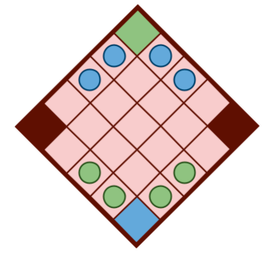
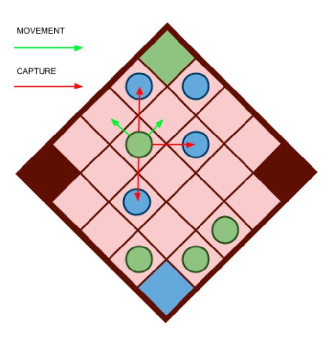

# Claustro

Luís Filipe da Silva Jesus - up202108683 - 50%
<br>
Miguel Diogo Andrade Rocha - up202108720 - 50%

## Installation and Execution

After installing SICStus Prolog, you can start the game with the following steps:

1. **Launch the SICStus Prolog environment.**
2. **Consult the `play.pl` file** that contains the game source code by using the **File menu** in the SICStus Prolog GUI or by entering the consult command in the SICStus Prolog console followed by the path of the file.

   ```prolog
   consult('path/to/play.pl').
   ```
3. Once the play.pl file has been consulted, **start the game** by typing the command:
      ```
      play.
      ```


## Game Description

### Board

- Claustro typicaly uses a 5x5 board/grid. However we made it possible for the user to choose the `width` and `height` of the board. Usually, the board is diagonally oriented between the **two players**. The two corners closest to each player are each other players' goal. 

- The other two corners of the board are neutral zones, where no pieces can be placed.


### Pieces

- Each player has `(width - 3) + (height - 3)` pieces. Initially, each piece is placed next to each other starting in each square orthogonally adjacent to the player starting corner.

<p align="center">
  
</p>

To disinguish between the two players, each player has a different color, for example, green and blue.

### Gameplay

Players take turns moving one of their pieces. In each turn, a player can move one of its pieces in the following ways:

- **Move**: Move a piece one square orthoganally towards the goal (considering it is not occupied).

- **Capture**: Captures are made by jumping one square (where there is an opponent's piece) diagonally. The captured piece is **not removed** from the board, but placed in any of the other free squares in the board, by the player who captured it, before the next turn.

<p align="center">
  
</p>

This procedure shall be repeated until one of the following conditions is met:
- A player successfully moves one of his pieces on his goal (opponent starting corner). In this case, he **wins the game.**

- A player cannot move nor capture opponent pieces with any of his pieces. In this case, he **wins the game.**

- Both players repeat the same move 3 times each. In this case, the last player to move **wins the game.**


- [Source](https://boardgamegeek.com/boardgame/391334/claustro)


## Game Logic

#### Internal Game State Representation:
- The main tuple representing the game state is of the form `(Turn, MoveHistory, Board)`:

  - Turn: An integer that indicates which player's turn it is. If the number is odd, then it represents the green player's turn.
  - MoveHistory: A list that records the moves made during the game. This can be used to undo moves or replay the game.
  - Board: A list of lists, where each sublist represents a row on the board. The elements of these sublists represent individual squares on the board, which can contain atoms such as `empty, blue, green, blueGoal, greenGoal, and neutral`. These atoms represent different pieces or states of a square on the board.

- **Dynamic Board Size:** The initial_state/2 predicate initializes the game board. It takes the dimensions of the board and applies a series of transformations (`setBoard, setSpecialSquares, setInitialPieces`) to set up the initial game board with pieces and special squares.

#### Examples of board states:

- **Initial State:** All pieces are in their starting positions.
  ```
  [
    [neutral, empty, blue, blue, greenGoal],
    [empty, empty, empty, empty, blue],
    [green, empty, empty, empty, blue],
    [green, empty, empty, empty, empty],
    [blueGoal, green, green, empty, neutral]
  ]
  ```

- **Intermediate State:** Some pieces have been moved from their starting positions.
  ```
    [
      [neutral, empty, blue, empty, greenGoal],
      [empty, green, empty, empty, blue],
      [empty, blue, empty, green, empty],
      [green, empty, empty, blue, empty],
      [blueGoal, empty, green, empty, neutral]
    ]
    ```

- **Final State:** The game has reached an end condition, like all pieces of one color have been captured. For example `blue` reached `blueGoal`
  ```
    [
      [neutral, empty, blue, empty, greenGoal],
      [empty, green, empty, empty, blue],
      [empty, blue, empty, green, empty],
      [green, empty, empty, blue, empty],
      [blue, empty, green, empty, neutral]
    ]
        ^
        |
  (blueGoal position)
    ```


Game Loop
The gameLoop/4 predicate is the heart of the game logic, where the actual gameplay occurs. This recursive predicate handles the sequence of events in the game:

Game Over Check: The predicate first checks if the game has ended by calling gameOver/2. If the game is over, it announces the winner and ends the recursion.
Piece Selection: It asks the current player (human or AI) to choose a piece with choosePiece/5.
Move Type Selection: Depending on the possible moves for the selected piece, it asks the player to choose a move type with chooseMoveType/4.
Move Execution: The chosen move is executed with move/3, which updates the game state.
Turn Handling: It updates the game state to reflect the change in turn with changeTurn/2.
Player Type Handling: It switches the player type if necessary with changePlayerType/3.
Display Update: The updated game state is displayed with displayGame/1, and the move history is printed with printMoveHistory/1.
Recursion: The predicate calls itself recursively to continue the game loop, passing the new game state and potentially the next player's type.


### Game State Visualization
- `display_game(+GameState)` is a predicate responsible for visualizing the current game state. It takes the current game state tuple and displays the board and other relevant information to the player. This includes displaying the columns and the pieces on the board using ASCII characters or symbols to represent different pieces.

- The game state visualization makes use of auxiliary predicates such as `displayCols/1, headerBorder/1, and displayBoard/3` to create a user-friendly display of the board. These predicates are designed to be flexible, accommodating boards of various sizes and configurations.


### Menu and Interaction

- **Input Validation:** Inside the gameloop, the system prompts the user for input and validates it, ensuring that the moves and selections made are within the acceptable range and logical for the game's current state, according to these predicates:

- `moveTypeChoice/2`: Presents the options for moving a piece or capturing a piece.
- `askMoveType/4`: Asks the user to select a move type, validating the move based on the game state.
- `choosePiece/5`: Allows the player to choose a piece to move, with the system handling both human and bot players.
- `askBoardPosition/4`: Prompts for a board position to move the piece and ensures the input is within the allowed range.
- `askReplacePosition/4`: In the event of a capture, this allows the user or bot to choose where to place the captured piece (must be an empty square).
- `choose_move/4:` The process of selecting a move during the game, handling different phases such as move execution, capture, and automated move selection based on the player type (human or bot).


## Move Validation and Execution

- The predicate responsible for move execution is `move/3`, taking the current game state and a proposed move, produces a new game state that reflects the move. However, the proposed move is validated before calling `move/3` while asking for user inputs as explained before or choosing random moves for the easy bot.

### Move Validation
- Before executing a move, it is validated using a set of rules defined for the game. These include:

 - **Movement:** A piece can move ortogonally in the direction of the playerGoal to an adjacent square if it is empty or to a goal square.

 - **Capture:** A piece can capture an opponent's piece if the opponent's piece is placed in an adjacent diagonal square.

 - **Game Over Conditions:**  The Game Over Conditions are checked in the gameloop after a move is executed. These conditions would end the game, such as reaching the opponent's goal line and having no valid moves available or both players making the same move 3 times in a row.

### Execution of Move
- #### Once a move has been validated, the move/3 predicate will:
  - Update the board to reflect the piece's new position.
  - Capture any opponent pieces if the move is a capturing move.
  - Update any state information that is dependent on the move, such as the turn number or scoring.
  - Return the new game state.

 ### Helpers and Utilities:
- Several helper predicates are used in conjunction with move/3:
  - `canMove/6` and `canCapture/6` for checking the validity of non-capturing and capturing moves, respectively.
  - `valid_move/3` and `valid_moves/3` for finding all valid moves for a piece or player.
  - `gameOver/2` for checking if a game-ending condition has been reached.
  - `change_cell/5` for modifying the board state by changing the value of a specified cell.


### Greedy Bot Behavior

`mostValueableMove/3`
- Selects the move with the highest score for the current player's piece based on move value calculations.

 `value/3`
- Evaluates the game state value from the perspective of `Player`, calculating the score based on the distance of all pieces from the goal.

`choose_move/4`
- Chooses and executes the best move based on a heuristic for the greedy bot. 
      
      0,9 * (1/Distance_from_Goal) + 0,1 * Can_Capture

- It uses the `mostValueableMove` predicate to select the best move and the `value` predicate to calculate the score before and after a potential move.
- The greedy bot picks the move that maximizes its position advantage, comparing the current score with the potential new score after the move.
- If the new game state score is greater than or equal to the current score, it chooses that move.


